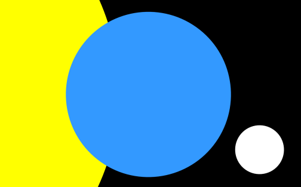
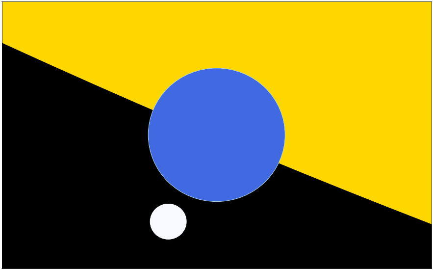

# world-flag

I was so inspired by the original [Flag of Earth](http://flagofearth.org/original.html), I wanted to try creating something similar in Python.

The Original:

- like original version, just use simple circles for elegance
- include Sun, Earth, Moon
- should colors should reflect something... effective temperatures? 
	- maybe...
- aspect ratio should be Pi:2
- radii ratio for 3 bodies should be correct
- inclination of [Moon's orbit](http://commons.wikimedia.org/wiki/File:Earth-Moon.svg) relative to Earth-Sun orbit should be correct
- ratio of separation between bodies maybe should be correct
	- this actually doesn't look that great...

## A *New* Flag of Earth
